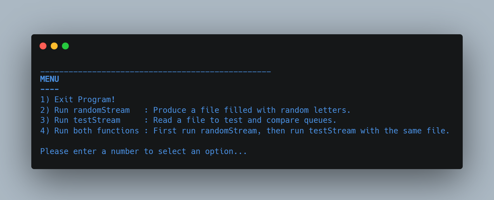
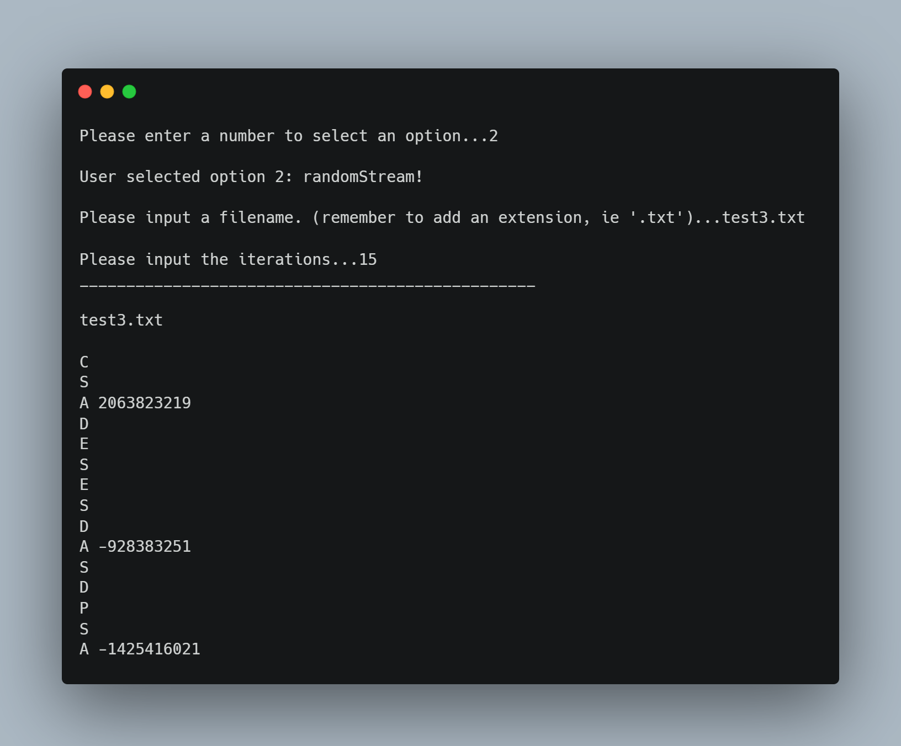
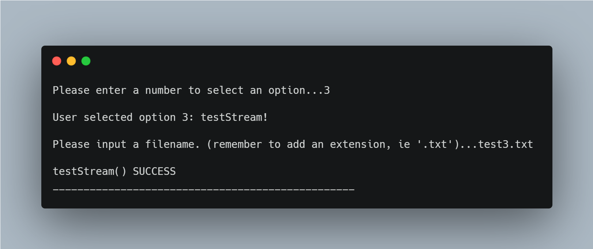
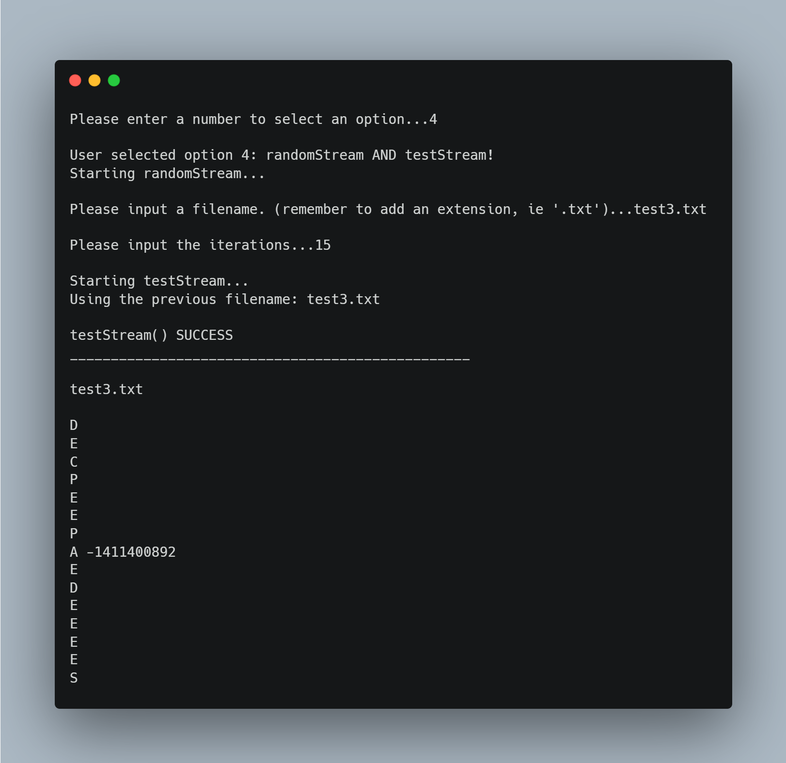

# RandStreams-on-Dynamic-Memory

(FSC-BCS-370-HW2)

## Output Menu

## Assignment Context

This project was the second of a three part series of assignments for my C++ Data Structures class.

The goal of this assignment was to use the Dynamic Memory of Mod5 with the Random Streams of HW1 to test four queues against each other.

HW1: https://github.com/alexander-harmaty/Random-Stream-Generator
Mod5: https://github.com/alexander-harmaty/Dynamic-Queue-Data-Structure

This project was made using C++ in Visual Studio 2022.

## Features

This C++ code opens with a menu for users to choose between 4 actions:
1. Exit program
2. Run randomStream (HW1)
3. Run testStream
4. Run randomStream then testStream

## How It Works

`testStream()` is the major difference between this project and HW1.
This function takes the randomStream characters and interprets them as queue instructions to build four queues.
"A #" is `enqueue()`, "P" is `peek()`, "D" is `dequeue()`, "E" is `isEmpty()`.

After reading the instructions and building four queues, testStream will compare the return status code for each.
For "A", if any of the enqueue() operations fail, the function stops and prints the line number from the instruction file.

For "P", the function ensures that all peek() operations return the same top string element. 
If any of the peek() operations fail or return different top string elements, the function stops and prints the line number from the instruction file.

For "D", the function ensures that all elements removed from each queue are the same. 
If any of the dequeue() operations fail or remove different elements, the function stops and prints the line number from the instruction file.

For "E", the function runs isEmpty() on all queues and checks the return values. 
If the queues are not all empty or all non-empty, the function stops and prints the line number from the instruction file.

If the instruction is anything other than D, E, P or A, the function ignores the line.

### Option 2

The `randomStream()` function prompts the user to name the file that will be used to save the generated random characters and letters.
This part is taken from the HW1 repository referenced in the Assignment Context.
See https://github.com/alexander-harmaty/Random-Stream-Generator

#### Output

### Option 3

This option is the first example of `testStream()`.

The function reads the instructions from the file whose name is passed to it as the filename parameter. 
The function then creates four instances of the farmingdale::queue ADT holding std::strings, calls the appropriate methods for each instruction in the file, and compares the results as described above.
If no failures and line errors return, then `testStream()` SUCCESS is to be expected.

#### Output

### Option 4

This option is a combination of options 2 & 3.
It first runs `randomStream()`, then `testStream()` on the same file.

#### Output

